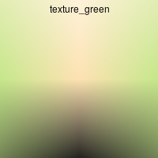
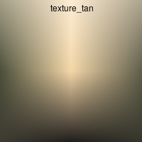
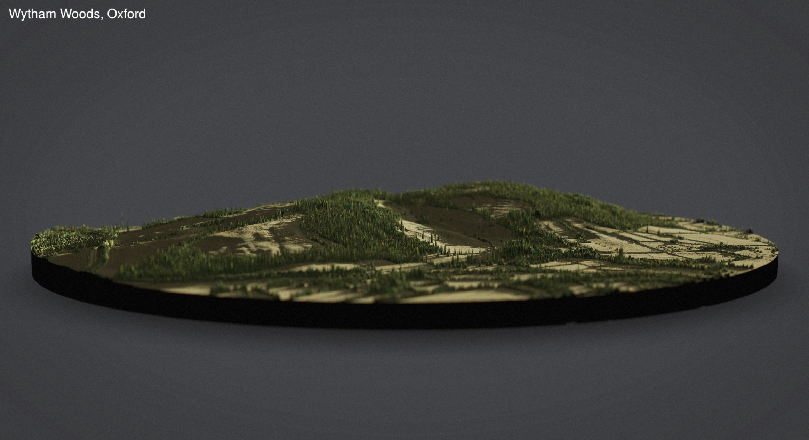
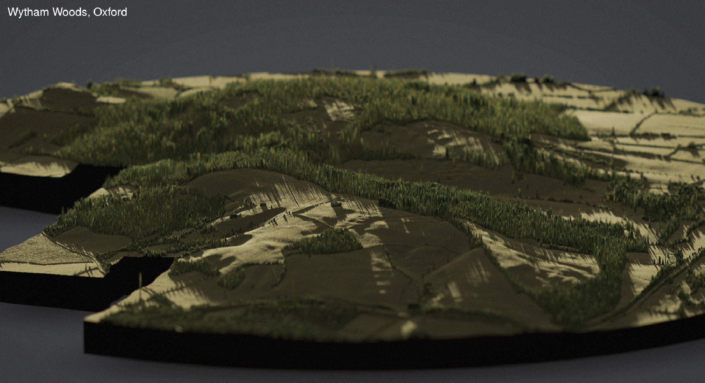
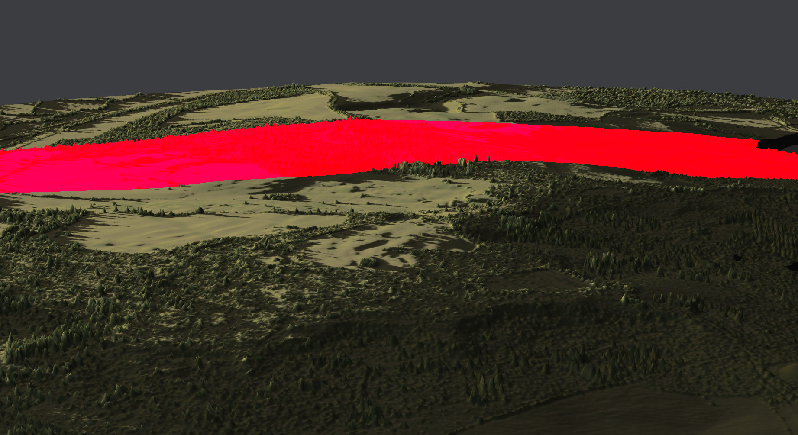
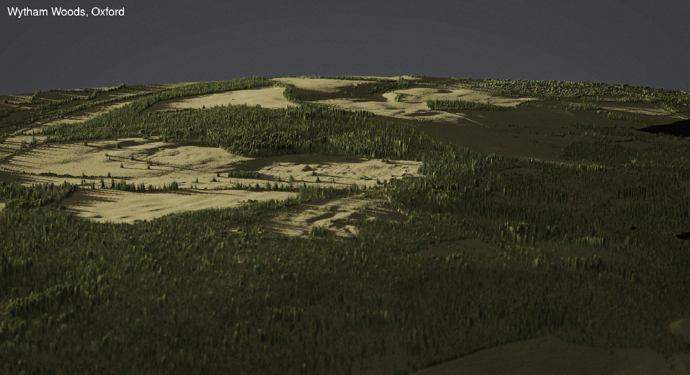
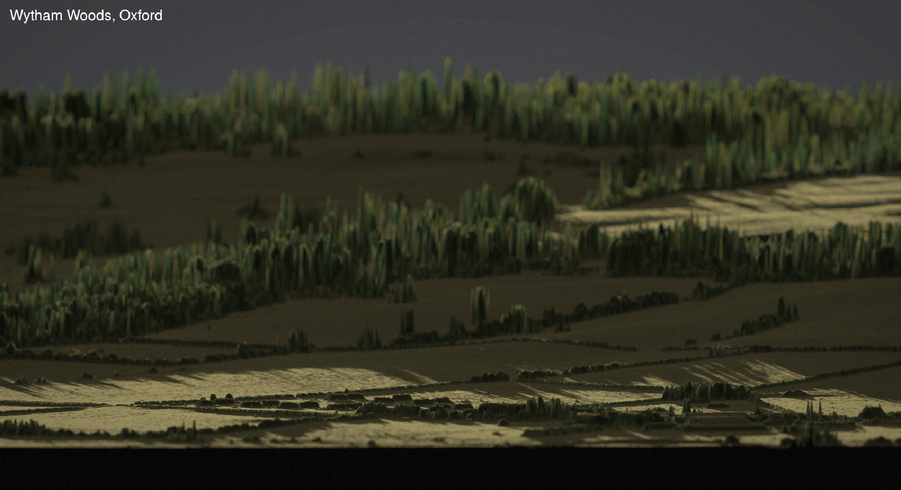

3D hillshaded maps of Wytham Woods
================
Nilo Merino Recalde<br>
24 March, 2020

  - [Download LiDAR data](#download-lidar-data)
  - [Read LiDAR elevation data, combine layers and select desired
    area](#read-lidar-elevation-data-combine-layers-and-select-desired-area)
  - [Render hillshaded 3D model](#render-hillshaded-3d-model)
  - [Aerial photography\!](#aerial-photography)

<br>

> **Notes:** <br> Paths are imported automatically when you load the
> project and read the source code. I have only tested this on a Linux
> machine (Ubuntu 18.04.4) but *should* be platform-independent. <br>
> This project is based on [Tyler
> Morgan-Wall](https://www.tylermw.com/)’s fantastic
> [Rayshader](https://www.rayshader.com/) package.

<br> <br>

### Download LiDAR data

From [the
horse’s](https://data.gov.uk/dataset/80c522cc-e0bf-4466-8409-57a04c456197/lidar-composite-dsm-2017-1m)
mouth:

> The LiDAR Composite DSM (Digital Surface Model) is a raster elevation
> model covering \>60% of England at 1m spatial resolution.

> The DSM (Digital Surface Model) is produced from the last return LIDAR
> signal and includes heights of objects, such as vehicles, buildings
> and vegetation, as well as the terrain surface. Available to download
> as ASCII files in 5km grids, data is presented in metres, referenced
> to Ordinance Survey Newlyn, using the OSTN’15 transformation. All
> LIDAR data has a vertical accuracy of +/-15cm RMSE.

Both the surface data used here and terrain-only data are available from
the Environment Agency
[here](https://environment.data.gov.uk/DefraDataDownload/?Mode=survey).
If you are not familiar with LiDAR technology,
[this](https://oceanservice.noaa.gov/facts/lidar.html) is a short
introduction.

To download:

``` r
download.file(sp40ne, sp40ne_zip)
download.file(sp40nw, sp40nw_zip)

sapply(list(sp40ne_zip, sp40nw_zip),
       unzip,
       exdir = paste0(raw_data_path))
```

<br>

### Read LiDAR elevation data, combine layers and select desired area

Here we create a subset of the data that only includes Wytham Woods.

``` r
# EPSG codes: (1) 27700 -- LiDAR data
#             (2) 4326  -- everything else
epsg1 <- 27700

# Coords of top right vertex of desired bounding rectangle
topR <- lat.long.reproject(51.790215, -1.289188, epsg1)

# Coords of bottom left vertex of desired bounding rectangle
bottomL <- lat.long.reproject(51.746210, -1.358950, epsg1)

# Define bounding box
boundbox <- extent(c(bottomL[1], topR[1], bottomL[2], topR[2]))

# Indicate reduction factor for matrix, 
# 1 = full size, < 1 = faster render
# Increase resolution before final render (!!!)
red <- 1

# Combine, crop, convert to matrix and reduce resolution
elevation_data_wytham <- 
  combine.lidar(raw_data_path) %>% 
  crop(., boundbox) %>%
  raster_to_matrix() %>%
  reduce_matrix_size(red) 
```

<br>

### Render hillshaded 3D model

I have built three colour palettes that work *ok* with these data, but
finding a single colour scheme that works for such diversity of textures
is quite challenging. You can add your own using `make.texture()`, which
is just a wrapper for Rayshader’s `create_texture()` that also names it
and saves an example.

   
   


Let’s use `texture_gold` for now.

``` r
render.scene(
  matrix = elevation_data_wytham, # LiDAR elevation data
  texture = texture_gold, # Texture (color palette) for plot
  sunaltitude = 9, # In degrees of arc from the horizon
  sunangle = 310, # In degrees of arc
) 
```

An ‘rgl’ window will now open. The ‘rgl’ device is interactive: you can
rotate by clicking and dragging with your left mouse button, control
zoom with the centre button and change the simulated focal length with
the right button. Have fun\!

<br>

### Aerial photography\!

We can grab a couple of snapshots from different angles before closing
the ‘rgl’ window. I have predefined some simulated cameras
(e.g. `angle_1` below), which can be found in the source code. Feel
free to add your own\!

##### A general view of the village of Wytham and the woods behind it:

``` r
take.snapshot(
  angle_1,
  title = "Wytham Woods, Oxford",
  focus = 0.8,
  focallength = 150,
  fstop = 5.6
)
```



<br>

##### A view of the Field Station and the FAI Farm from the hills:

``` r
take.snapshot(
  angle_2,
  title = "The JK Field Station, seen from the Singing Way",
  focus = 0.9999938,
  focallength = 1,
  fstop = 0.4,
    preview = T
)
```


<br>

##### A view of the woods with Marley Plantation, Marley and Bean in the foreground

``` r
take.snapshot(
  angle_3,
  title = "Wytham Woods, Oxford",
  focus = 0.4,
  focallength = 50,
  fstop = 4,
)
```



<br>

Now, let’s render the same scene with different lighting: a lower ‘sun’
shining from the ENE. You might have noticed that, in the previous
images, the hills looked taller than they actually are - their real
height is a bit, ahem, underwhelming. This time, let’s take them down to
their real height by setting `exaggerate_z` to `FALSE`. I included this
argument that makes everything 40% taller beacuse, well, why not.

``` r
render.scene(
  matrix = elevation_data_wytham,
  exaggerate_z = FALSE,
  texture = texture_gold,
  sunaltitude = 2,
  sunangle = 70,
) 
```

**Tip:** You can preview the focal point by setting `preview = TRUE`:



And here is the resulting image:

``` r
take.snapshot(
  angle_4,
  title = "Wytham Woods, Oxford",
  focus = 0.97,
  focallength = 50,
  fstop = 0.85,
  preview = FALSE
)
```



<br>

##### The John Krebs Field Station and FAI Farm

``` r
render.scene(
  matrix = elevation_data_wytham,
  exaggerate_z = FALSE,
  texture = texture_gold,
  sunaltitude = 4,
  sunangle = 190,
) 
```

**Tip:** If you want to save the 3D object to avoid re-rendering it, use
`save_obj()` while the ‘rgl’ device is open.

``` r
take.snapshot(
  angle_6,
  title = "Wytham Woods, Oxford",
  focus = 0.28,
  focallength = 50,
  fstop = 3.2
)
```



<br>

And that’s it - for now\!
